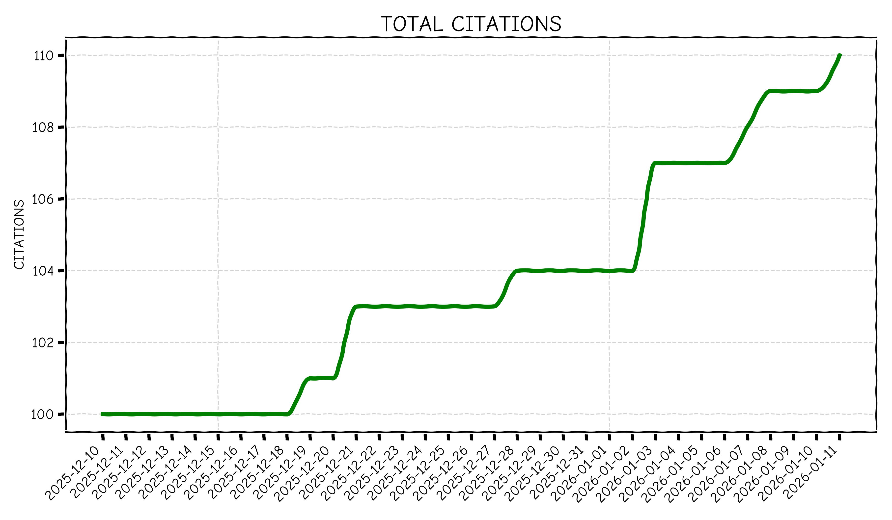
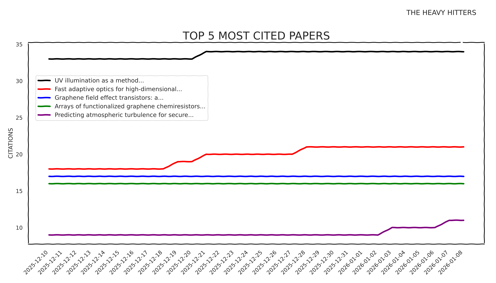

Citation count is not an indicator of a good scientist or good science. It is, however, a number and the monkey part of my brain likes to see numbers go up. It feels good to know that people are reading my papers and enjoying the work that I devote my time to.

Below we can see which papers are the most enjoyed.

1. [UV Illumination as a Method to Improve the Performance of Gas Sensors Based on Graphene Field-Effect Transistors](https://pubs.acs.org/doi/abs/10.1021/acssensors.1c01783)
2. [Fast adaptive optics for high-dimensional quantum communications in turbulent channels](https://www.nature.com/articles/s42005-025-01986-6)
3. [Graphene Field Effect Transistors: A Sensitive Platform for Detecting Sarin](https://pubs.acs.org/doi/abs/10.1021/acsami.1c17770)
4. [Arrays of Functionalized Graphene Chemiresistors for Selective Sensing of Volatile Organic Compounds](https://pubs.acs.org/doi/abs/10.1021/acsaelm.2c01544)
5. [Predicting atmospheric turbulence for secure quantum communications in free space](https://opg.optica.org/oe/fulltext.cfm?uri=oe-33-5-10759)